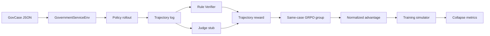

# 架构说明

## 1. 项目边界

政务办理不是单轮问答，而是多轮决策任务。Agent 需要在信息不完整、政策规则约束和风险控制约束下选择下一步动作，直到提交或拒答。

本仓库使用纯 Python 实现离线教学环境。它能解释数据和训练信号如何流动，但不会在本机训练 8B 模型。

## 2. 数据流



## 3. Case schema

每个 `data/cases/*.json` 包含四类信息：

| 字段 | 可见性 | 作用 |
| --- | --- | --- |
| `visible` | Agent 初始可见 | 用户诉求、已知槽位 |
| `hidden_truth` | 环境持有 | 用户追问结果、材料状态、风险标记 |
| `policy_rules` | 通过查询工具返回 | 必填槽位、必要工具、材料要求、资格阈值 |
| `expected_result` | 仅评估器可见 | 离线标准答案 |

最重要的隔离原则：策略不得读取 `expected_result`。只有 Verifier 可以读取它。

## 4. Action space

| Action | 作用 |
| --- | --- |
| `ASK_USER` | 追问缺失槽位 |
| `POLICY_SEARCH` | 查询政策规则 |
| `ELIGIBILITY_CHECK` | 校验资格 |
| `MATERIAL_CHECK` | 校验材料 |
| `RISK_CHECK` | 校验风险 |
| `SUBMIT` | 提交 |
| `REFUSE` | 拒答或转人工 |

环境将每一步的 `state`、`action`、`observation`、槽位完成状态和失败标签写入 trajectory。

## 5. Reward

`src/gov_agent_rl/scoring.py` 提供两套配置：

- `collapse_prone`：故意保留薄弱约束，用于复现故障。
- `hardened`：强制必要工具调用，降低 Judge 权重，并处罚错误提交、过早拒答和槽位缺失。

生产环境中，Verifier 负责硬事实，Judge 只负责难以规则化的表达质量。不要让 Judge 决定资格、材料和风险事实。

## 6. GRPO

对同一个 case 采样多条 rollout，得到 reward 后计算：

```text
advantage_i = (reward_i - group_mean) / group_std
```

组内方差接近零时，所有 advantage 都接近零，对比训练信号变弱。这正是策略坍塌需要重点监控的指标之一。

## 7. 生产替换点

本仓库的 `train_policy_mixture` 更新的是行为策略分布。真实 GRPO 训练需要替换为：

1. 当前模型对同一 prompt 采样多条 token 序列。
2. 保存 response token 的旧策略 log probability。
3. 计算 trajectory reward 和组内 advantage。
4. 使用 clipped policy objective、KL 约束和 entropy bonus 更新模型参数。
5. 保留本仓库的 case schema、Verifier/Judge、trajectory log 和监控指标。
